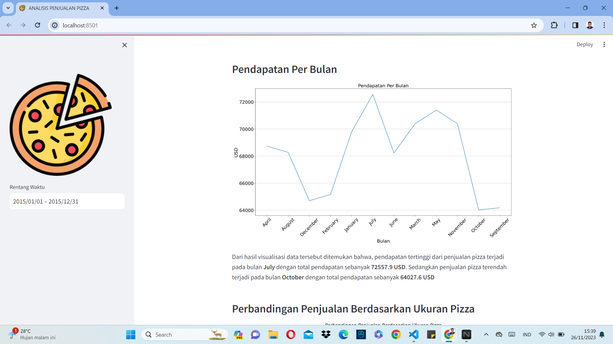
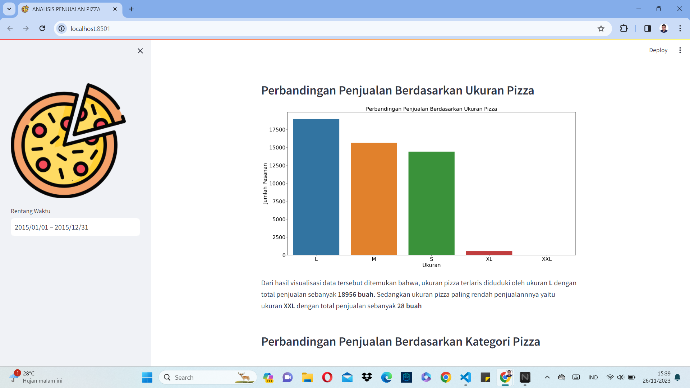

# ANALISIS PENJUALAN PIZZA

Analisis penjualan pizza merupakan latihan mandiri yang saya lakukan. Pada projek ini saya menganalisis dan mengembangkan dashboard dari sebuah dataset. Dataset tersebut dapat dilihat pada link berikut ini : [KLIK DISINI][https://www.kaggle.com/datasets/shilongzhuang/pizza-sales]

## Mulai Bekerja

1. Kloning Repositori ini

```
https://github.com/iqbalpurba26/Analisis-Penjualan-Pizza.git
```

. Persiapan Lingkungan

```
conda create --name main-ds python=3.10
conda activate main-ds
pip install pandas matplotlib seaborn streamlit
```

3. Jalankan Aplikasi Streamlit

```
streamlit run dashboard.py
```

## Screenshot Tampilan







